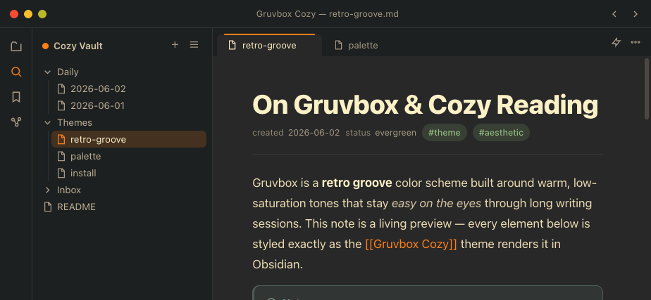
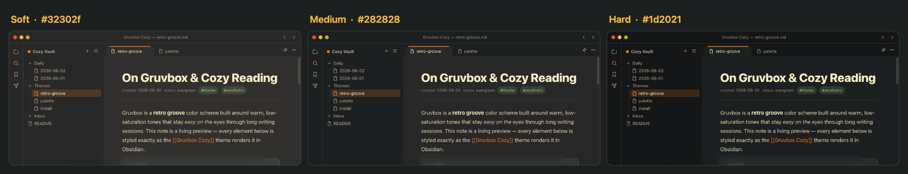
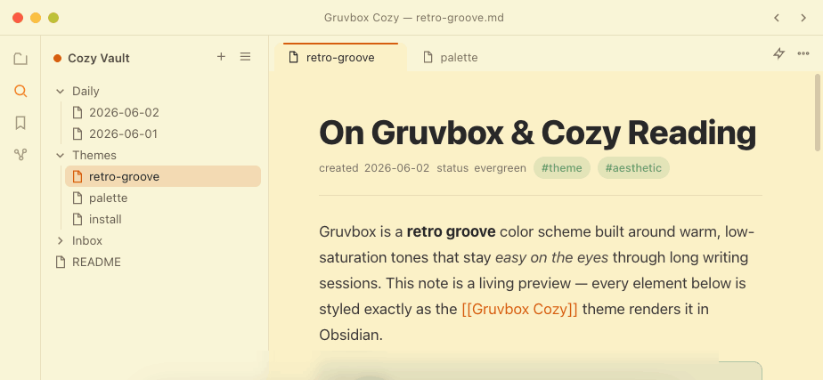
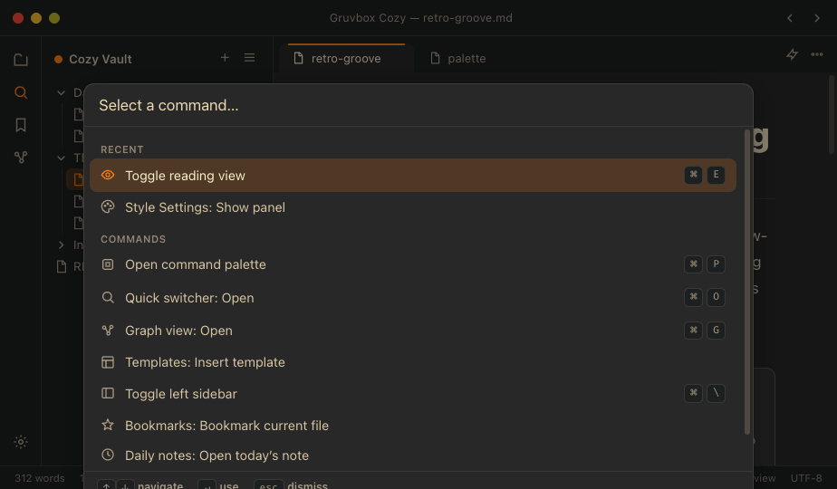
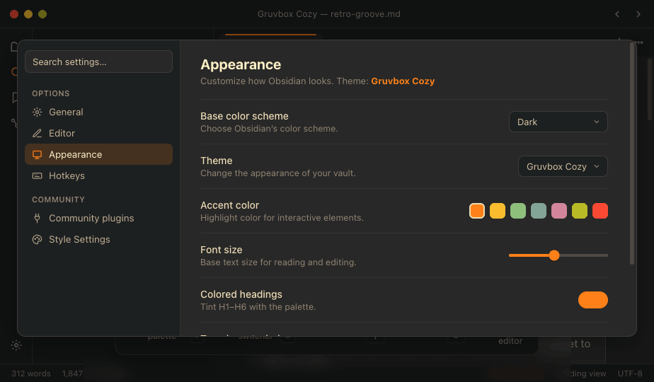
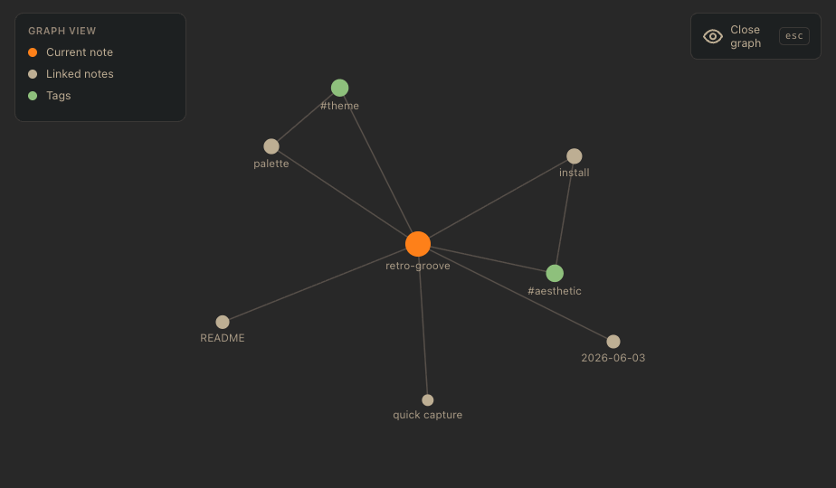
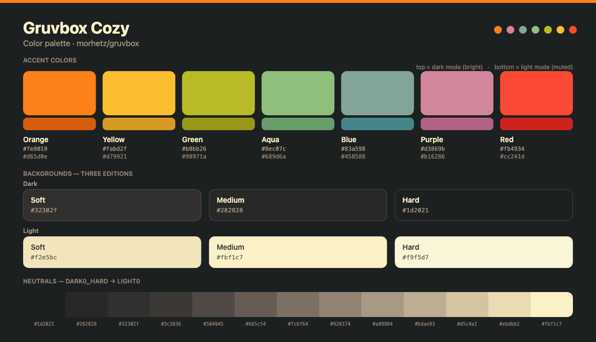

<div align="center">

# 🟫 Gruvbox Cozy

### A warm, retro-groove theme for [Obsidian](https://obsidian.md)

Built on Pavel Pertsev's beloved [Gruvbox](https://github.com/morhetz/gruvbox) palette — no pure black, no pure white, just warm browns and soft cream that stay easy on the eyes through long reading and writing sessions.



</div>

---

## ✨ Features

- 🌗 **Dark *and* light** — a deep retro-groove dark and a warm cream light, both fully styled
- 🎚️ **Three contrast editions** — Soft, Medium, and Hard, shipped as independent themes
- 🎨 **Colored headings** — H1–H6 tinted with the palette, Gruvbox-style (toggleable)
- 🌈 **7 accent colors** — orange, yellow, aqua, blue, purple, green, red
- 🔤 **3 reading fonts** — sans-serif, serif, or monospace
- 🧩 **Full syntax highlighting**, warm callouts, accent blockquotes, colored checkboxes & tags
- 🍁 **Pixel-art maple leaf** — an optional, subtle watermark in the file explorer
- 🟤 **Dotted note background** — an optional, subtle dot-grid paper texture behind your notes
- ✅ **Colored task states** — `/` `!` `?` `>` `-` checkboxes colored & labelled (works with the Tasks plugin)
- ⚙️ **[Style Settings](https://github.com/mgmeyers/obsidian-style-settings) support** — change accent, font and more without touching code
- 📐 Built entirely on Obsidian's stable CSS-variable system — tracks current releases (tested on **1.13.x**)

## 🎚️ The three editions

Only the **background tones** change between editions — accent, cream text and every highlight color stay identical. Pick the depth you like; each works on its own with no plugin required.



| Edition | Dark background | Best for |
| --- | --- | --- |
| **Gruvbox Cozy Soft** | `#32302f` | the warmest, coziest feel |
| **Gruvbox Cozy Medium** | `#282828` | the classic Gruvbox look |
| **Gruvbox Cozy Hard** | `#1d2021` | the deepest, highest contrast |

## 🖼️ More looks

| Light mode | Command palette |
| --- | --- |
|  |  |

| Settings · Appearance | Graph view |
| --- | --- |
|  |  |

## 📦 Installation

### Manual (recommended)

1. Download this repository (**Code → Download ZIP**, or clone it).
2. Pick an edition from [`themes/`](themes/) — e.g. `themes/gruvbox-cozy-medium/`.
3. Copy that folder into your vault's `.obsidian/themes/` folder and rename it to match the theme, e.g. `Gruvbox Cozy Medium`. The `.obsidian` folder lives at the root of your vault (enable "show hidden files" if you can't see it):
   - **macOS:** `~/YourVault/.obsidian/themes/`
   - **Windows:** `C:\Users\You\YourVault\.obsidian\themes\`
   - **Linux:** `~/YourVault/.obsidian/themes/`
4. In Obsidian, open **Settings → Appearance → Themes** and pick it from the dropdown. Done. 🎉

> Each edition folder already contains everything Obsidian needs: `theme.css`, `manifest.json` and `versions.json`.

You can install all three side by side — they show up as separate entries in the theme picker, so switching contrast is one click.

> 💡 **Tip:** open **Settings → Appearance** and turn off "Show hidden files" worries — you can reach the themes folder directly via the small **folder icon** next to *Themes*.

→ Full walkthrough (finding the folder, mobile, updating, troubleshooting) in **[docs/installation.md](docs/installation.md)**.

### Live preview (no install)

Open [`preview/index.html`](preview/index.html) in any browser to explore the full theme — editor, command palette (`⌘P`), quick switcher (`⌘O`), settings (`⌘,`), graph (`⌘G`) and context menu — and flip mode / contrast / accent / font live.

## ⚙️ Customization

With the **[Style Settings](https://github.com/mgmeyers/obsidian-style-settings)** plugin you can switch accent color, reading font, colored headings, italic emphasis, the maple-leaf watermark, the dot-grid background and colored task states — all from the settings panel. Or override any `--gb-*` variable in a CSS snippet.

→ See **[docs/customization.md](docs/customization.md)** for every option and variable.

## 🎨 Palette



The full Gruvbox → Obsidian color mapping (dark + light) lives in **[docs/palette.md](docs/palette.md)**.

## 🗂️ Project structure

```
gruvbox-cozy/
├── themes/                  # the installable themes (Soft · Medium · Hard)
│   ├── gruvbox-cozy-soft/
│   ├── gruvbox-cozy-medium/
│   └── gruvbox-cozy-hard/
├── preview/                 # interactive HTML demo of the theme
├── docs/                    # installation, customization, palette, screenshots
├── art/                     # 🍁 the maple leaf as ASCII text (easter egg)
├── CHANGELOG.md
├── LICENSE
└── README.md
```

> 🍁 *Easter egg:* the sidebar maple leaf also lives as ASCII art in [`art/maple-leaf.txt`](art/maple-leaf.txt) — free to reuse anywhere.

## 🙏 Credits

- Palette: **[morhetz/gruvbox](https://github.com/morhetz/gruvbox)** by Pavel Pertsev
- Theme & preview: built with Claude

## 📄 License

Released under the [MIT License](LICENSE). The Gruvbox palette is © Pavel Pertsev, also MIT-licensed.
